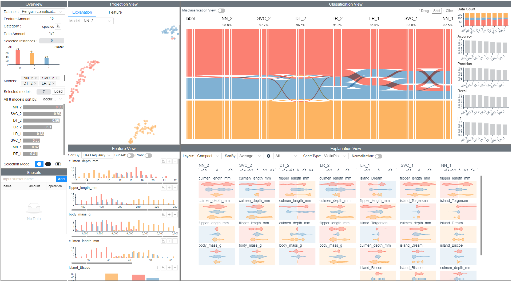

# ModelWise

Codes for the visual analytics method *ModelWise* which is described in our paper "ModelWise: Interactive Model Comparison for Model
Diagnosis, Improvement and Selection". 

online demo (real-time projection is not supported): https://modelwise.herokuapp.com/ 

## Introduction

||
|:--:| 
| *Interface screenshot of ModelWise* |

ModelWise provides a visual analytics method to assist data scientists in analyzing and comparing
classification models wisely. ModelWise integrates model performance, model explanation,
and feature space for multi-perspective exploration while supporting multiple workflows to achieve model diagnosis, improvement, and selection.


## Quick Start
You can run the code with demo cases by following the steps below.

Step1: Start the backend. (python is installed)

*The backend is developed with flask and tested with python 3.8.
```
cd backend
pip install -r requirements.txt
flask run --port 5000
```
Step2: Start the frontend. (Nodejs is installed)
```
cd frontend
npm install
npm run dev
```
Step3: Open your browser http://localhost:3000/


## How to put your own data and models into ModelWise
First, you need to create a new folder under the path `./backend/db`. Then you need to generate four files (features.csv, featuretypes.csv, models.json, prediction.csv) for your own case and put them in the folder you create. You can refer to the folder structure and file content of penguin or diabetes under `./backend/db` as examples. 

* *features.csv*: save the feature names and values for the dataset.
* *featuretypes.csv*: specify feature types. Each type should be one of strings "class, int, float, categorical". "class" must be specified for the predicted feature.
* *models.json*: save all the information about the models you want to compare including model name (model), used feature names (features), predicted feature values (classes), model performance metrics (accuracy, f1, precision) and shap values (shap).
* *predictions.csv*: prediction values of all models.

Please refer to the jupyter notebook in the preprocessing folder as an example about how to generate these files. 

## Citation
If you use this code for your research, please consider citing:
```
@article {10.1111:cgf.14525,
journal = {Computer Graphics Forum},
title = {{ModelWise: Interactive Model Comparison for Model Diagnosis, Improvement and Selection}},
author = {Meng, Linhao and Elzen, Stef van den and Vilanova, Anna},
year = {2022},
publisher = {The Eurographics Association and John Wiley & Sons Ltd.},
ISSN = {1467-8659},
DOI = {10.1111/cgf.14525}
}
```

## License
ModelWise is published under the BSD 3-Clause License, as found in the LICENSE file.
